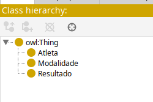
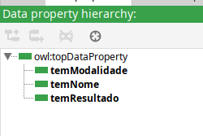
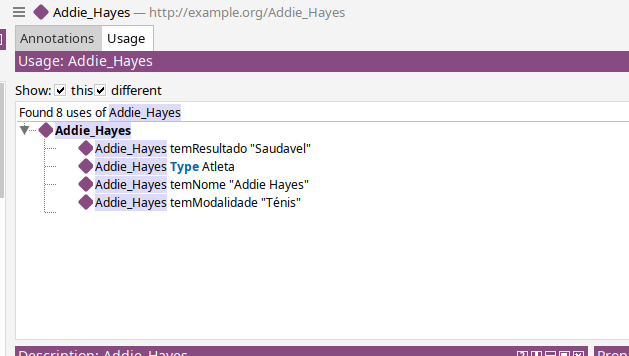

# TPC1 :  Conversão de um JSON para TTL

**Nome:** Gonçalo Araújo Brandão

**ID:** pg57874

## Descrição

O objetivo do primeiro trabalho de casa era converter um fichiero json para ttl, para ser subtimido diretamente no protege e não termos de criar cada individio à mão no protege, automatizando o processo. 

### Trabalho realizado

Começamos por perceber como as nossas 3 classes seriam definida, sendo que aplicamos essa definção a cada entrada do json. 

Após defenirmos corretamente as 3 classes e confirmar-mos no protege que estavam a ser defenidas corretamente, criamos as 3 relações nessarias entre elas, temNome, temModalidade, tem Resultado. 

### Resultados Obtidos

